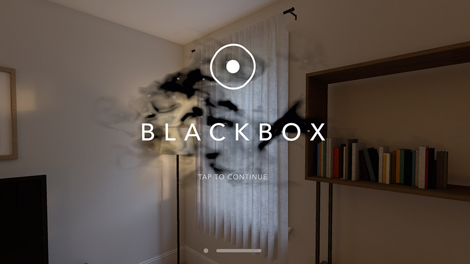
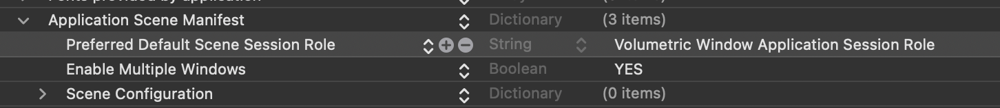

# Start with a transparent background



[eg. Blackbox for vision app](https://apps.apple.com/us/app/blackbox-for-vision/id6458588937)

투명한 배경으로 앱 화면을 시작하고 싶은 경우가 있다. Window에서는 투명한 배경을 적용할 수 없다. (혹시 방법이 있다면 Issue 또는 PR에 남겨주세요.) `Volumetric Window`로 시작 Scene을 지정해주는 방법으로 문제를 해결해볼 수 있다. 

## Get started

1. Window 화면을 만들고 `windowStyle(.volumetric)`으로 지정
```swift
@main
struct SampleApp: App {
  var body: some Scene {
    /// Entry window group
    WindowGroup(id: "splash") {
      SplashScreen()
    }
    .windowStyle(.volumetric)
  }
}

/// Splash screen
struct SplashScreen: View {
  var body: some View {
    Text("Hello World!")
      .font(.largeTitle)
  }
}
```

2. 시작 Scene을 Volumetric Window Application Session Role로 변경

