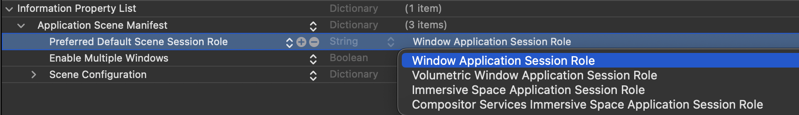
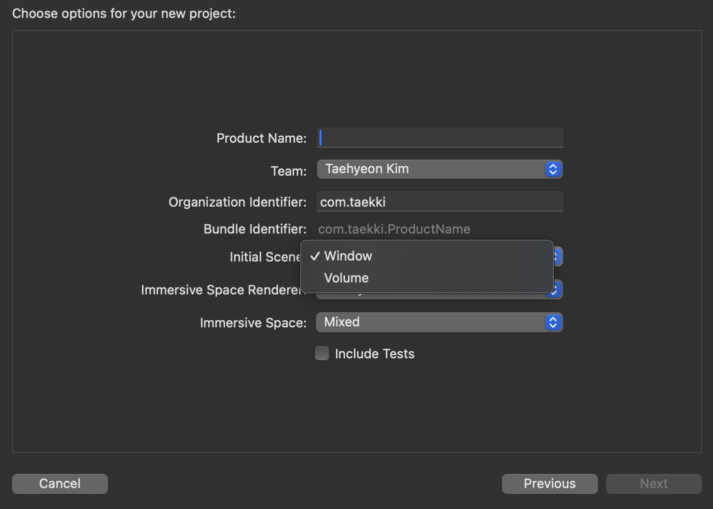

# 001-Presenting windows and spaces
Open and close the scenes that make up your app’s interface.

## Summary
- 프로그래밍 방식으로 Window, Space를 열고 닫는 방법을 소개합니다.
- 시작 화면으로 Window, Volume, Space를 설정하는 방법을 소개합니다.

## Open windows programmatically
새 창(New window)를 열 수 있는 방법에 대해서 소개합니다.

```swift
struct NewViewerButton: View {
  @Environment(\.openWindow) private var openWindow

  var body: some View {
    Button("New Mail Viewer") {
      openWindow(id: "mail-viewer")
    }
  }
}
```

## Close windows programmatically
창(window)를 닫을 수 있는 방법은 2가지가 있습니다:
1. **시스템 컨트롤 사용**
  <br> 내장되어 있는 닫기 버튼을 의미합니다.
2. **프로그래밍 방식 사용**
  <br> `dismissWindow` 환경 변수를 사용합니다. 닫고자 하는 Window의 id를 확인하세요.

```swift
private struct MailViewer: View {
  @Environment(\.dismissWindow) private var dismissWindow

  var body: some View {
    Button("Dismiss MailViewer") {
      dismissWindow(id: "mail-viewer")
    }
  }
}
```

iPad 및 visionOS에서는 유일하게 열려 있는 Window에 대해서 위의 Action을 수행하려고 하면 시스템이 이를 무시합니다.


MailViewer Window만 남은 상황입니다. 여기서 `Dismiss MailViewer` 버튼을 눌러서 Window를 닫으려고 하면 그 동작이 무시됩니다.

## Open a space programmatically
여기서 Space(공간)라 함은 Immersive space(몰입형 공간)를 의미합니다. Window(창)를 여는 것과 비슷한 방식으로 열 수 있습니다.

이 작업은 비동기적으로 동작하므로 작업 수행 시 `await` 키워드를 붙여주어야 하고 일반적으로 Task 내에서 수행합니다.

> [!Note]  
> 몰입형 공간은 사용자 주변 환경에서 제한 없이 콘텐츠를 표시할 수 있는 Scene(장면)입니다.

```swift
struct NewSpaceButton: View {
  @Environment(\.openImmersiveSpace) private var openImmersiveSpace

  var body: some View {
    Button("View Orbits") {
      Task {
        await openImmersiveSpace(id: "orbits")
      }
    }
  }
}
```

앱이 전체 공간에서 작동하므로 ImmersiveSpace Scene은 한 번에 하나씩만 열 수 있습니다. 이미 열려 있는 Scene이라면 런타임 오류가 발생합니다.

앱은 Immersive space와 함께 여러 개의 Window를 표시할 수 있습니다. 여기서 주의해야 할 점은 일반적으로 Space를 열면 시스템에서 다른 앱에 속한 모든 Window를 숨긴다는 점입니다. Immersive space는 하나의 앱만 사용할 수 있다는 의미와도 같습니다. 현재 공간을 차지하고 있는 앱이 여러 개의 Window를 띄우는 것은 문제 없지만 다른 앱이 띄우는 Window는 숨겨집니다.

Space를 닫으면 그제서야 다른 앱의 Window가 나타납니다.

## Close spaces programmatically

Space를 닫기 위해서는 `dismissImmersiveSpace` 환경 변수를 사용하면 됩니다.

```swift
private struct ContentView: View {
  @Environment(\.dismissImmersiveSpace) private var dismissImmersiveSpace


  var body: some View {
    Button("Done") {
      Task {
        await dismissImmersiveSpace()
      }
    }
  }
}
```

Window와는 다르게 id를 지정해서 닫을 필요가 없습니다. Space의 경우 한 번에 하나만 열 수 있기 때문입니다. 마찬가지로 앱에서 유일하게 남은 Scene이 Space라면 `dismissImmersiveSpace` 작업은 동작하지 않습니다. (eg. Window → Space로 Scene이 열려 있는 상태라면 동작할 것입니다.)

## Transition between a window and a space

VisionOS 앱에서는 마지막으로 열려 있던 Window나 ImmersiveSpace를 프로그래밍 방식으로 닫을 수 없으므로 이전 장면을 닫기 전에 새 장면을 열어야 합니다.

Window와 ImmersiveSpace 사이를 이동할때는 Space의 열기 및 닫기 동작이 비동기적으로 실행되므로 순서에 주의해야합니다.

누군가 버튼을 탭하면 앱이 창을 닫고 체스판이 표시된 몰입형 공간을 엽니다. 다음 버튼은 공간을 연 다음 창을 닫음으로써 적절한 순서를 표시합니다.(닫고 여는 것이 불가능하므로 순서를 다음과 같이 설정합니다.)
```swift
Button("Start") {
  Task {
    await openImmersiveSpace(id: "chessboard")
    dismissWindow(id: "start") // Runs after the space opens.
  }
}
```
`dismissWindow` 작업을 Task 안에 두어야 `openImmersiveSpace` 가 완전히 수행될 때까지 기다렸다가 작업을 수행합니다. 만약 외부에 `dismissWindow` 작업을 위치시키면 `openImmersiveSpace` 가 수행되기전에 호출되어 원하는 동작을 수행하지 못할 수 있습니다.

## Designate a space as your app’s main interface
앱의 기본 인터페이스로 ImmersiveSpace를 지정할 수 있습니다. ImmersiveSpace로 즉시 앱을 열기 위해서는 plist에 `UIApplicationPreferredDefaultSceneSessionRole` Key를 지정하고 `UISceneSessionRoleImmersiveSpaceApplication` 를 Value로 지정하면 됩니다. 그럼 시스템은 App 선언부에서 찾은 첫 번째 Space를 엽니다.

다음은 실제 plist 설정을 보여줍니다.




옵션은 4가지가 있습니다:
- Window Application Session Role
- Volumetric Window Application Session Role
- Immmersive Space Application Session Role
- Compositor Services Immmersive Space Application Session Role


최초 VisionOS 프로젝트 생성 시에도 Scene 타입을 정해줄 수 있지만 이 때는 Window/Volume 만 선택할 수 있습니다. (플랫폼을 visionOS로 선택했을 때 옵션을 확인할 수 있습니다.)

