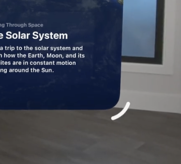

# Positioning and sizing windows
Influence the initial geometry of windows that your app presents.

## Overview
visionOS와 macOS는 window를 움직이거나 크기를 재조정할 수 있습니다. 특정한 경우에는 초기 geometry를 결정하기 위해서 scene modifier를 사용할 수 있습니다.

이러한 설정은 window, volume에 모두 영향을 줍니다. 여기서 volume은 volumetric window style이 적용된 window를 의미합니다.

```swift
WindowGroup(id: "globe") {
  Globe()
}
.windowStyle(.volumetric)
```

몇 가지 제약조건이 존재합니다:

- window 크기 조정 가능 범위를 벗어나면 시스템은 범위 내에서 dimension을 유지하기 위해서 window를 고정합니다.
- window의 콘텐츠를 변경할 수는 있지만 창이 나타난 후에는 window 위치나 크기를 직접 조작할 수 없습니다. (여기서 말하는 동작은 프로그래밍 방식을 의미합니다.)
- 상태 복원 중에 시스템은 window를 이전 위치와 크기로 복원합니다.

## Specify initial window position
macOS에서는 일반적으로 기본 postion을 지정할 수 있습니다. 그러나 visionOS에서는 window의 기본 위치를 지정할 수 없습니다. 이는 사용자 경험과도 관련있습니다.

> [!Important]  
> 항상 시스템은 Window를 여는 순간 바라보고 있는 앞에 배치합니다.  
> 이는 새 창을 인식하는데 도움이 됩니다.  
> 실제로 기기를 사용해보면 무슨 말인지 이해할 수 있습니다.

## Specify initial window size

`defaultSize(width:height:)` scene modifier를 이용해서 window의 초기 생성 크기를 지정할 수 있습니다.

```swift
@main
struct MyApp: App {
  var body: some Scene {
    WindowGroup {
      ContentView()
    }
    .defaultSize(CGSize(width: 600, height: 400))
  }
}
```

window의 실제 크기도 제한할 수 있습니다. 위의 설정은 초기 생성 크기만 정해주는 것이기 때문에 이후 사용자가 window를 자유롭게 축소, 확대할 수 있습니다.

## Specify window resizability

visionOS는 기본적으로 window의 오른쪽 하단 모서리를 볼 때 나타나는 컨트롤러 window 크기를 조정할 수 있습니다.



기본 Resizability는 `automatic`입니다. 아래와 같이 `.contentSize` 전략을 사용하면 Window의 최소 및 최대 크기를 콘텐츠의 최소 및 최대 크기와 일치하도록 만들 수 있습니다. Window를 특정 크기로 고정하는 것도 가능합니다. `.contentMinSize`를 사용해서 최소 크기 제한을 유지하지만 최대 크기는 제한히지 않도록 만들 수도 있습니다.
```swift
@main
struct MyApp: App {
  var body: some Scene {
    WindowGroup {
      ContentView()
        .frame(
          minWidth: 100, maxWidth: 400,
          minHeight: 100, maxHeight: 400)
    }
    .windowResizability(.contentSize)
  }
}
```

## Specify a volume size

Volumetric 스타일을 가진 Window인 Volume을 만들 때 3차원 크기 조정자를 가지고 Volume의 크기를 조정할 수 있습니다.

```swift
WindowGroup(id: "globe") {
  Globe()
}
.windowStyle(.volumetric)
.defaultSize(width: 1, height: 1, depth: 1, in: .meters)
```

런타임에는 Volume의 크기를 변경할 수 없습니다. Volume의 크기를 포인트로 지정할 수도 있지만 일반적으로 Meter 단위로 크기를 지정하는 것과 같이 물리적 단위를 사용하는 것이 좋습니다. 시스템이 일반 Window와 다르게 동적 스케일링이 아닌 고정 스케일링으로 Volume을 렌더링하기 때문에 Volume이 사용자 인터페이스보다 물리적 개체처럼 보이기 때문입니다.