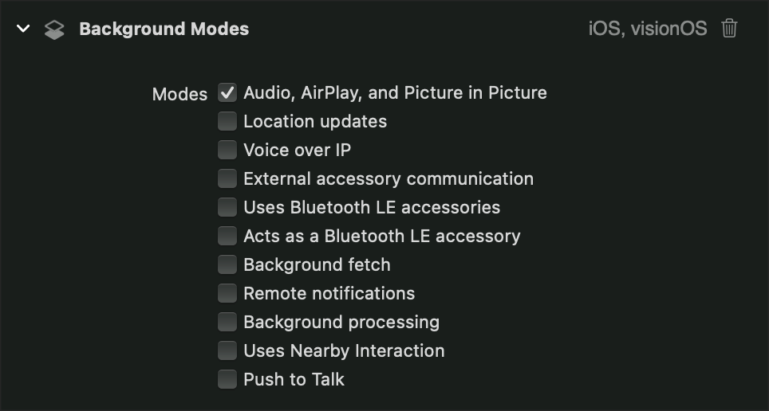

# Configuring your app for media playback
Configure apps to enable standard media playback behavior.

## Overview
iOS, tvOS, visionOS에서 미디어 재생 앱을 빌드하려고 할 때, 예상되는 재생 동작을 활성화하려면 추가 설정이 필요합니다. 오디오 환경 및 백그라운드 작업을 구성하면 앱의 오디오가 의도한 대로 작동하도록 보장할 수 있습니다. 또한 지원되는 플랫폼에서 AirPlay 스트리밍, PIP 재생과 같은 고급 기능을 사용할 수 있습니다.

## Configure the audio session

주로 앱에 제어권을 맡기는 macOS를 제외한 Apple 플랫폼은 운영 체제가 관리하는 오디오 환경을 제공합니다. 이를 통해서 사용자가 앱 간에 전환하거나, 전화 또는 FaceTime 통화와 같이 우선순위가 높은 오디오 요청을 수신할 때 OS가 원활한 오디오 환경을 제공할 수 있습니다.

앱은 AVAudioSession을 사용하여 오디오 동작을 의미론적으로 구성합니다(예를 들면 재생 또는 녹음이 주 목적). 이러한 세부 사항의 관리를 오디오 세션에 위임하면 운영 체제가 오디오 경험을 가장 잘 관리할 수 있습니다.

앱에는 자동으로 시스템이 이 기본 동작으로 구성하는 오디오 세션이 있습니다:
- 앱에서 오디오 재생 시 다른 백그라운드 오디오가 음소거됩니다.
- 오디오 재생은 지원하지만 오디오 녹음은 지원하지 않습니다.
- iOS에서 Ring/Slient 스위치를 무음 모드로 설정하면 앱 오디오가 무음으로 전환됩니다.
- iOS에서 기기를 잠그면 앱 오디오가 음소거됩니다.

기본 오디오 세션은 유용한 동작을 제공하지만 전형적으로 재생 앱을 구축할 때 필요한 경험이나 기능을 제공하지는 않습니다. 필요한 동작을 추가하기 위해서 앱 오디오 세션 카테고리(audio session category)를 구성합니다.

오디오 세션 카테고리는 앱에 필요한 일반적인 오디오 동작을 정의합니다. AVFoundation을 사용할 수 있는 여러 오디오 세션 카테고리를 정의하지만 미디어 재생 앱에 가장 적합한 카테고리는 재생입니다. 이 카테고리는 미디어 재생이 앱의 핵심 기능임을 나타냅니다. 이 카테고리를 지정하면 iOS에서만 벨소리/무음 스위치를 무음 모드로 설정해도 시스템에서 앱의 오디오를 무음으로 설정하지 않습니다. 이 카테고리를 활성화하면 아래 섹션에 설명된 대로 오디오, AirPlay 및 PIP 백그라운드 모드를 사용하는 경우 앱에서 백그라운드 오디오를 재생할 수 있습니다.

AVAudioSession 객체를 사용하여 앱의 오디오 세션을 구성합니다. 오디오 세션은 오디오 세션 카테고리, 모드 및 기타 설정을 설정하는 데 사용하는 싱글톤 객체입니다. 동영상 재생을 최적화하도록 오디오 세션을 구성하려면 다음과 같이 하세요.

```swift
class PlayerModel: ObservableObject {
  func configureAudioSession() {
    do {
      let session = AVAudioSession.sharedInstance()
      // Configure the app for playback of long-form movies.
      try session.setCategory(.playback, mode: .moviePlayback)
    } catch {
      // Handle error.
    }
  }
}
```
이 카테고리를 활성화하려면 setActive(_:options:)메서드를 사용하여 오디오 세션을 활성화하세요. 카테고리를 설정한 후 언제든지 오디오 세션을 활성화할 수 있지만, 앱에서 오디오 재생이 시작될 때까지 이 호출을 연기하는 것이 좋습니다. 호출을 연기하면 진행 중인 다른 백그라운드 오디오가 조기에 중단되지 않도록 할 수 있습니다.

카테고리 설정은 오디오 세션과 최소한의 상호 작용이지만 다른 구성 옵션과 기능을 사용할 수 있습니다. 예를 들어 VisionOS에서는 오디오 세션을 구성하여 사용자의 공간 오디오 환경을 커스터마이즈할 수 있습니다.

## Configure the background modes
시스템에서 일부 백그라운드 작업을 수행하려면 특정 capabilities를 사용하도록 설정해야 합니다. 재생 앱에 필요한 일반적인 기능은 백그라운드 오디오 재생입니다. 이 기능을 활성화하면 사용자가 다른 앱으로 전환하거나 iOS 기기를 잠글 때에도 앱의 오디오가 계속 재생됩니다. 또한 지원되는 플랫폼에서 AirPlay 스트리밍 및 PIP와 같은 고급 재생 기능을 사용하려면 앱에 이 기능이 필요합니다.

capaility를 구성하기 위해서 Xcode로 가세요:
1. Xcode 안의 Target을 선택, Signing & Capabilities 탭을 선택하세요.
2. `+ Capability` 버튼을 클릭하세요. 그리고 Background Modes capability를 프로젝트에 추가하세요.
3. Background Modes 인터페이스에서 `Audio, AirPlay, and Picture in Picture` 옵션을 선택하세요.



이 모드를 활성화하고 오디오 세션을 구성하면, 앱은 백그라운드 오디오 재생을 할 준비가 됩니다. iOS에서는 이 옵션을 활성화하면 앱이 AirPlay를 통해 콘텐츠를 스트리밍할 수 있습니다. 그리고 iOS와 tvOS에서는 Picture in Picture(PIP) 재생을 할 수 있습니다.
