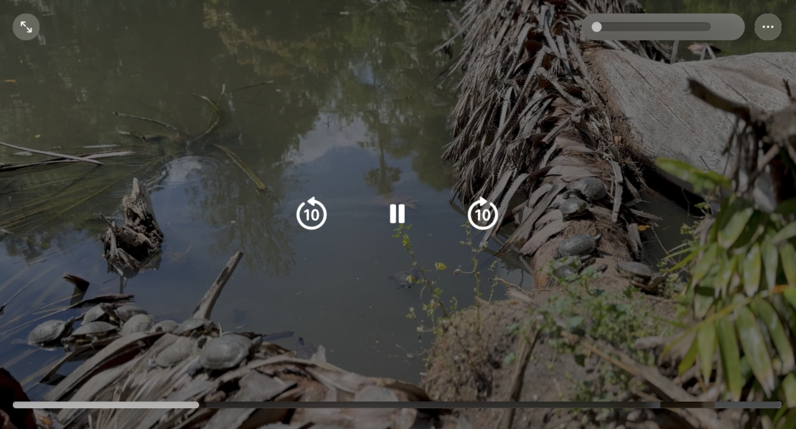

# Adopting the system player interface in visionOS
Provide an optimized viewing experience for watching 3D video content.

## Overview
visionOS 앱에서 비디오 재생 인터페이스를 제공하기 위해 가장 추천하는 방식은 `AVPlayerViewController`를 채택하는 것입니다. 이 클래스를 사용하면 TV, Music과 같은 시스템 앱에서 볼 수 있는 재생 UI(사용자 인터페이스)와 기능을 간편하게 제공할 수 있습니다.

또한 표준 2D 콘텐츠를 재생하든 공간 오디오가 포함된 몰입형 3D 비디오를 재생하든 최적의 시청 경험을 제공하기 위해 필수적인 시스템 통합 기능을 제공합니다. 이 문서는 visionOS에서 플레이어를 표시하는 모범 사례를 설명하고 앱에 가장 적합하도록 플레이어가 제공하는 UI를 커스터마이즈하는 옵션도 다룹니다.

시스템 재생 인터페이스를 제공할 뿐만 아니라 AVPlayerViewController를 사용하여 macOS의 QuickTime Player와 유사한 미디어 트리밍(media-trmming) 환경을 제공할 수도 잇습니다.

> [!Note]  
> 미디어 트리밍이란 미디어에서 불필요한 부분을 제거하거나 편집하는 등의 작업을 의미합니다.

## Explore presentation options

visionOS의 windowed 환경에서 비디오를 재생하기 위해 `AVPlayerViewcontroller`를 사용하세요. 그것은 자동으로 Presentation에 가장 적합하도록 UI를 조정합니다. 예를 들면 다른 뷰 안에 중첩하여 표시하는 경우에는 인라인 사용자 인터페이스를 표시합니다: 플레이어를 인라인으로 제시하면 표준 2D 동영상만 표시됩니다. 3D 콘텐츠를 재생하려면 전체 화면으로 표시합니다. 플레이어를 앱의 독점 루트 뷰로 설정하거나 `fullScreenCover(item:onDismiss:content:)` modifier를 사용해서 플레이어를 전체 화면 모드로 표시합니다.



전체 화면 모드에서는 플레이어가 기본적으로 환경을 어둡게하여 보다 적합한 시청 환경을 제공하는 콘텐츠 중심적인 디자인을 제공합니다. 이를 통해 2D 및 3D 콘텐츠 모두에 대해 간소화된 시청 환경을 제공합니다.


## Display supporting metadata

현재 플레이어 항목에 제목 및 자막 메타데이터가 포함된 경우 사용자 인터페이스는 `transport bar` 위에 타이틀 뷰를 표시합니다. 실시간 스트리밍 콘텐츠를 재생할 때 타이틀 뷰에 콘텐츠 상태를 나타내는 배지(Badge)가 표시될 수도 있습니다.


타이틀 뷰는 사용 가능한 경우 asset의 `commonIdentifierTitle`과 `iTunesMetadataTrackSubTitle` 메타데이터 항목의 값을 표시합니다. 미디어가 내장된 메타데이터를 제공하지 않는 경우, `AVMetadataItem`의 인스턴스를 생성하여 표시할 추가 메타데이터를 추가할 수 있습니다.


아래 표는 플레이어 사용자 인터페이스가 지원하는 메타데이터 값을 나타냅니다.
|Metadata|Identifier|Type|
|:--|:--|:--|
|Title|commonIdentifierTitle|String|
|Subtitle|iTunesMetadataTrackSubTitle|String|
|Artwork|commonIdentifierArtwork|Data|
|Description|commonIdentifierDescription|String|
|Genre|quickTimeMetadataGenre|String|
|Content rating|iTunesMetadataContentRating|String|

String과 Data 타입의 항목을 가지는 간단한 구조체를 만들고 적절한 메타데이터 identifier에 값을 매핑하고 `AVMetadataItem` 배열로 만들 수 있습니다.

```swift
private func createMetadataItems(for metadata: Metadata) -> [AVMetadataItem] {
  [
    metadataItem(key: .commonIdentifierTitle, value: metadata.title),
    metadataItem(key: .iTunesMetadataTrackSubTitle, value: metadata.subtitle),
    metadataItem(key: .commonIdentifierArtwork, value: metadata.imageData),
    metadataItem(key: .commonIdentifierDescription, value: metadata.description),
    metadataItem(key: .iTunesMetadataContentRating, value: metadata.rating),
    metadataItem(key: .quickTimeMetadataGenre, value: metadata.genre)
  ]
}

private func metadataItem(
  key identifier: AVMetadataIdentifier,
  value: Any
  ) -> AVMetadataItem {
  let item = AVMutableMetadataItem()
  item.identifier = identifier
  item.value = value as? NSCopying & NSObjectProtocol
  item.extendedLanguageTag = "und"
  // Return an immutable copy of the item.
  return item.copy() as! AVMetadataItem
}
```

현재 플레이어 아이템에 메타데이터를 적용하려면 메타데이터 항목의 배열을 플레이어 아이템의 externalMetadata 프로퍼티 값으로 설정합니다.
```swift
let metadata: Metadata = // A structure that contains simple string values.
playerItem.externalMetadata = createMetadataItems(for: metadata)
```

title view에는 title과 subtitle 값만 표시됩니다. 플레이어는 지원되는 다른 메타데이터 값을 정보 탭에 표시합니다.

## Display custom informational views
visionOS Player UI는 사용자 인터페이스에 하나 이상의 콘텐츠 탭을 표시하여 지원하는 정보 또는 관련 콘텐츠를 표시할 수 있습니다. 기본적으로 Player는 Asset에 Embeded 메타데이터가 포함되어 있거나 PlayerItem에 External 메타데이터를 설정한 경우 정보 탭을 표시합니다.

앱에서 지원 콘텐츠를 표시하는 사용자 지정 탭을 표시할 수도 있습니다. 탭 콘텐츠를 SwiftUI 뷰로 정의하고 UIHostingController로 래핑한 다음에 `customInfoViewControllers` 프로퍼티로 설정하면 됩니다. Player UI는 hosting controller의 title 프로퍼티를 사용해서 인터페이스에서 탭 제목으로 표시합니다.


## Present actions in the Info tab
Player UI는 표시되는 에셋이 Embeded 또는 External 메타데이터를 제공하는 경우 정보 탭을 표시합니다. 탭의 보기에는 메타데이터 세부 정보가 표시되며, 그 아래쪽 가장자리를 따라 **최대 2개의 UIAction 컨트롤**이 표시될 수 있습니다.


PlayerViewController의 infoViewActions 속성의 값을 설정해서 뷰가 표시하는 동작을 커스텀합니다. 비라이브 콘텐츠를 재생할 때 이 속성에는 처음부터 콘텐츠를 재생하는 동작을 표시하는 단일 요소 배열이 포함됩니다. 기본값(있는 경우)을 바꾸거나 추가 동작을 추가하거나 이 속성 값을 빈 배열로 설정하여 동작을 표시하지 않을 수 있습니다. 아래 예에서는 뷰에 즐겨찾기에 추가 동작을 추가하는 방법을 보여 줍니다:

```swift
let infoCircle = UIImage(systemName: "info.circle")
let showMoreInfo = UIAction(title: "More Information", image: infoCircle) { action in
    // Navigate to a screen to display more information.
}
// Append the action to the array.
playerViewController.infoViewActions.append(showMoreInfo)
```

## Display actions contextually
visionOS Player UI를 사용하여 앱에서 콘텐츠의 특정 시간 동안 표시한 다음 해제하는 컨트롤을 상황에 맞게 표시할 수 있습니다. 이러한 유형의 컨트롤은 영화나 TV 프로그램의 타이틀 시퀀스 중에 표시되는 스킵 버튼에 일반적으로 사용됩니다. 사람들은 이 버튼을 탭하여 도입부를 건너뛰고 주요 콘텐츠로 빠르게 이동할 수 있습니다. (eg. OTT 서비스의 영상 시청 시 `줄거리 건너뛰기` 버튼 노출)


AVPlayerViewController는 표시할 동작을 하나 이상 지정하는 데 사용할 수 있는 contextualActions 프로퍼티를 제공합니다. Player는 화면 하단에 해당 액션을 표시합니다. 다음 코드 예제는 Player가 메인 콘텐츠의 타임라인으로 이동하는 동작의 간단한 구현을 보여줍니다.

```swift
// Define an action to skip the intro of a media item.
private lazy var skipActions: [UIAction] = {
    [UIAction(title: "Skip Intro") { [weak self] _ in
        guard let self else { return }
        avPlayer.seek(to: skipToTime)
    }]
}()
```

contextualActions의 프로퍼티의 값을 설정하면 플레이어가 컨트롤을 즉시 표시합니다. 콘텐츠의 관련 섹션 중에만 컨트롤을 표시하려면 `periodic 또는 boundary time observer`를 추가해서 Player의 타이밍을 관찰합니다. 다음 예제는 일반 재생 중에 매 초마다 실행되는 `periodic time observer`를 정의합니다. 각 호출에서 새 시간을 평가(evaluate)하여 프레젠테이션 범위 내에 있는지 범위 여부를 결정합니다. 이 예제에서는 범위 내에 있으면 건너뛰기(skip) 동작을 `contextual action` 값으로 설정하고, 그렇지 않으면 빈 배열로 설정해서 값을 지웁니다.

```swift
private func addTimeObserver() {
    // Observe the player's timing every second.
    let interval = CMTime(value: 1, timescale: 1)
    let fifteenSeconds = CMTime (value: 15, timescale: 1)
    timeObserver = avPlayer.addPeriodicTimeObserver(forInterval: interval,
                                                    queue: .main) { [weak self] time in
        guard let self else { return }
        let duration = avPlayer.currentItem?.duration ?? .zero
        // Show the Skip Intro button during the first 15 seconds of the content.
        showSkipIntroAction = time <= fifteenSeconds
    }
}
```