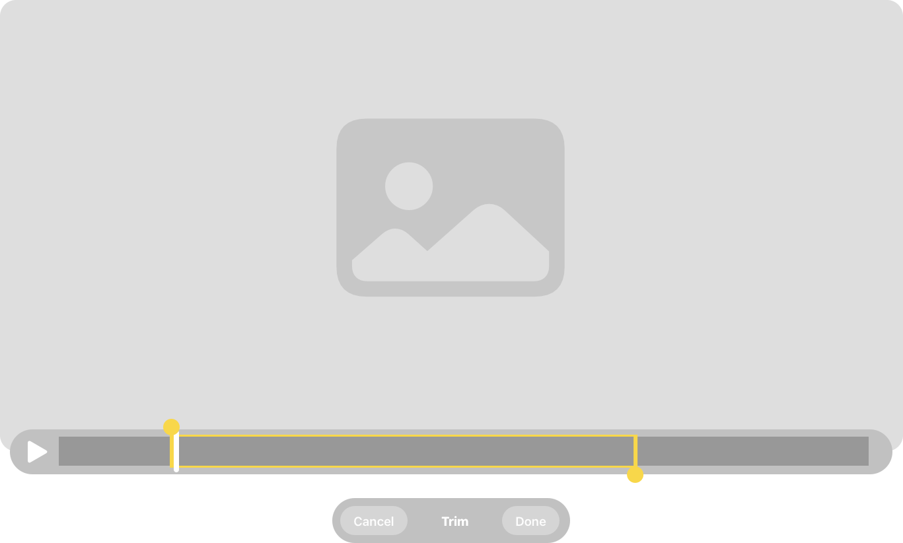

# Trimming and exporting media in visionOS
Display standard controls in your app to edit the timeline of the currently playing media.

## Overview

- System Player 인터페이스를 사용하기 위해서 `AVPlayerViewController`를 사용합니다.
- Primary Role을 추가하면 macOS의 QuickTimePlayer와 같이 `Media-Trimming` 기능과 비슷한 기능을 구현할 수 있습니다.



## Determine whether the media supports trimming

`HTTP Live Streaming`과 `보호된 컨텐츠`를 제공하는 경우 trimming을 지원하지 않기 때문에 앱은 `canBeginTrimming` 프로퍼티의 상태를 관찰해야 합니다. 아래의 코드는 `canBeginTrimming` 프로퍼티의 상태를 관찰하고, 그에 따라 `Published 프로퍼티`를 업데이트 합니다.

```swift
@Published private(set) var isTrimming = true
@Published private(set) var supportsTrimming = true

var controller: AVPlayerViewController? {
    didSet {
        // Reset the internal state variables to false and exit.
        guard let controller else {
            isTrimming = false
            supportsTrimming = false
            return
        }
        // Connect the AVPlayer object to the the view controller.
        controller.player = player
        /// Update the state of `supportsTrimming` based on the value of `canBeginTrimming`.
        controller.publisher(for: \.canBeginTrimming)
            .removeDuplicates()
            .assign(to: &$supportsTrimming)
    }
}
```

## Enable the trimming user interface

PlayerViewController가 앱의 현재 타임라인을 편집하는지 결정한 후에 Player의 `beginTrimming(completionHandler:)` 메서드를 호출하세요. 이 메서드는 비동기 컨텍스트에서 동작합니다.

```swift
/// Enables the player view controller's media trimming interface.
func startTrimming() async {
    // Exit early if the controller doesn't support trimming.
    guard let controller, controller.canBeginTrimming else { return }
    
    isTrimming = true
    if await controller.beginTrimming() {
        // A user pinched the button to complete the trim operation.
    } else {
        // A user pinched the button to cancel their changes.
    }
    isTrimming = false
}
```

이 메서드는 사용자가 Done 버튼을 pinch 했는지, Cancel 버튼을 pinch 했는지 대해 Boolean 값을 반환합니다. Done 버튼을 pinch 하는 것은 player의 아이템의 `reversePlaybackEndTime`과 `forwardPlaybackEndTime` 프로퍼티의 값이 trimmed된 값과 일치하도록 View Controller가 업데이트하도록 합니다.

## Export the trimmed media selection
trimmed된 부분을 내보내는 편리한 방법은 `AVAssetExportSession`을 사용하는 것입니다. 이 객체는 간단한 프리셋 기반 접근을 제공해서 다양한 포맷으로 트랜스코딩해줍니다. Player 아이템의 에셋과 외부 프리셋을 전달함으로써 `export session` 인스턴스를 생성하세요. 추가로 `ouput URL`과 `file type`을 설정하세요.

```swift
// Export the asset in the highest quality.
let preset = AVAssetExportPresetHighestQuality
// Check the compatibility of the preset to export the video to the output file type.
guard await AVAssetExportSession.compatibility(ofExportPreset: preset,
                                               with: playerItem.asset,
                                               outputFileType: .mp4) else {
    print("The selected preset can't export the video to the output file type.")
    return
}

guard let exportSession = AVAssetExportSession(asset: playerItem.asset,
                                               presetName: preset) else {
    print("Unable to create an export session that supports the asset and preset.")
    return
}
```

trimmed된 부분만 외부 자산으로 export하기 위해서는 현재 아이템의 역방향, 정방향 재생 시간을 기준으로 `CMTimeRange`를 생성하세요.

```swift
// Create a time range that matches the trimmed selection.
let startTime = playerItem.reversePlaybackEndTime
let endTime = playerItem.forwardPlaybackEndTime
exportSession.timeRange = CMTimeRange(start: startTime, end: endTime)
```

최종적으로 미디어를 `output URL`로 비동기 트랜스코딩을 시작하기 위해서 export 작업을 시작하세요.

```swift
// Export the content.
await exportSession.export()
```