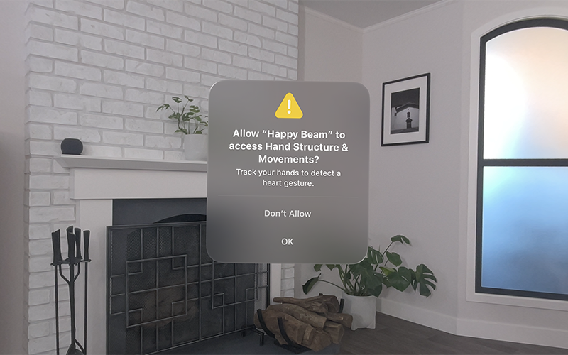

# Setting up access to ARKit data
Check whether your app can use ARKit and respect people’s privacy.

## Overview
visionOS에서 ARKit은 `hand tracking` 및 `world sensing`과 같은 데이터를 활용하는 새로운 종류의 경험을 구현할 수 있습니다. 

시스템은 이러한 종류의 민감한 정보에 대한 액세스를 차단합니다. 사람들이 앱의 ARKit 데이터 사용 요청을 거부하거나 나중에 액세스 권한을 취소할 수 있으므로 앱을 사용할 수 있는 대체 방법을 제공하고 앱이 데이터에 액세스하지 못하는 경우를 처리해야 합니다.




## Add usage descriptions for ARKit data access

사람들은 앱이 ARKit의 데이터에 액세스하려는 이유를 알아야 합니다. 앱의 `Info-plist`에 다음 키를 추가하여 앱이 데이터를 사용하는 방법을 설명하는 사용자 대상 사용 설명을 제공하세요:

`NSHandsTrackingUsageDescription`
- hand tracking(손 추적)을 사용하는 경우

`NSWorldSensingUsageDescription`
- image tracking(이미지 추적)
- plane detection(평면 감지)
- scene reconstruction(장면 재구성)

> [!Note]  
> `World tracking`의 경우 `World sensing`과 달리 인증이 필요하지 않습니다.
> 자세한 내용은 [Tracking specific points in world space](https://developer.apple.com/documentation/visionos/tracking-points-in-world-space)을 참고하세요.


## Choose between up-front or as-needed authorization
다른 사람이 ARKit 데이터를 사용하기 위한 권한 요청을 볼 시기를 선택할 수 있습니다. 요청이 표시되는 시기를 정밀하게 제어해야 하는 경우 ARKitSession의 `requestAuthorization(for:)` 메서드를 호출하여 호출 시점에 명시적으로 액세스를 승인합니다. 

그렇지 않으면 `run(_:)` 메서드를 호출할 때 권한 요청이 표시됩니다. 요청 시기는 전적으로 세션을 시작하는 시점에 따라 달라지므로 이는 암시적 권한(implicit authorization) 부여입니다.

## Open a space and run a session

사용자의 개인정보를 보호하기 위해 **앱이 전체 공간을 표시하고 다른 앱은 숨긴 경우** (`Full Immersive Space`)에만 ARKit 데이터를 사용할 수 있습니다. `run(_:)` 메서드를 호출하기 전에 이러한 공간 스타일 중 하나를 제시하세요.

다음은 ARKit에서 Space를 사용하도록 설정된 앱 구조를 보여줍니다:

```swift
@main
struct MyApp: App {
    @State var session = ARKitSession()
    @State var immersionState: ImmersionStyle = .mixed
    var body: some Scene {
        WindowGroup {
            ContentView()
        }
        ImmersiveSpace(id: "appSpace") {
            MixedImmersionView()
            .task {
                let planeData = PlaneDetectionProvider(alignments: [.horizontal])
                
                if PlaneDetectionProvider.isSupported {
                    do {
                        try await session.run([planeData])
                        for await update in planeData.anchorUpdates {
                            // Update app state.
                        }
                    } catch {
                        print("ARKit session error \(error)")
                    }
                }
            }
        }
        .immersionStyle(selection: $immersionState, in: .mixed)
    }
}
```

앱의 사용자 인터페이스에서 openImmersiveSpace를 호출하여 스페이스를 생성하고 ARKit 세션 실행을 시작하고 몰입형 경험을 시작하세요. 다음은 Space를 여는 버튼이 있는 간단한 View를 보여줍니다:

```swift
struct ContentView: View {
    @Environment(\.openImmersiveSpace) private var openImmersiveSpace
    
    var body: some View {
        Button("Start ARKit experience") {
            Task {
                await openImmersiveSpace(id: "appSpace")
            }
        }
    }
}
```

## Provide alternatives for declined and revoked authorizations

> `ARKit에만 의존하도록 앱을 구성하는 것을 피하라`라고 이야기하고 있습니다.

누군가가 앱에 ARKit의 데이터에 대한 액세스 권한을 부여하고 싶지 않거나 나중에 설정에서 해당 액세스 권한을 취소하고 싶을 수 있습니다. 이러한 상황을 유연하게 처리하고 ARKit 데이터에 의존하는 콘텐츠를 제거하거나 전환하세요. 

예를 들어 제거해야 하는 콘텐츠나 최신 콘텐츠를 적절한 시작 위치로 페이드아웃할 수 있습니다. 앱에서 ARKit 데이터를 사용하여 사용자의 주변 환경에 콘텐츠를 배치하는 경우 사용자가 시스템에서 제공하는 인터페이스를 사용하여 콘텐츠를 배치할 수 있도록 하는 것이 좋습니다.

사용자 입력에 ARKit을 사용하는 경우 대안을 제공하는 것이 특히 중요합니다. 접근성 기능, 트랙패드, 키보드 또는 다른 형태의 입력을 사용하는 사람들은 ARKit 없이 앱을 사용할 수 있는 방법이 필요할 수 있습니다.